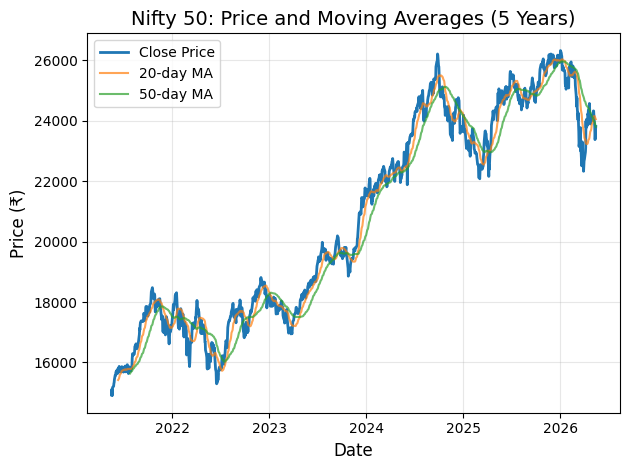

# Nifty 50 — Exploratory Data Analysis

Analyzed 5 years of historical Nifty 50 stock data to explore price patterns, compute technical indicators, and visualize long-term market trends using Python.

Built this during my summer internship at NIT Rourkela (May–Jul 2025) as part of a research project on Indian equity market prediction.

---

## What This Does

- Downloads 5 years of daily OHLCV data for the Nifty 50 index from Yahoo Finance
- Cleans and preprocesses the time-series data (handles missing values from weekends/holidays)
- Calculates technical indicators: Daily Returns, 20-day Moving Average, 50-day Moving Average
- Visualizes price trends with moving average overlays
- Saves processed data to CSV for downstream modeling

## Chart



*Nifty 50 closing price with 20-day and 50-day moving averages (May 2021 – May 2026)*

## Dataset

| Detail | Value |
|--------|-------|
| Source | Yahoo Finance (yfinance API) |
| Ticker | ^NSEI (Nifty 50 Index) |
| Period | 5 years (May 2021 – May 2026) |
| Data Points | 1,236 trading days |
| Features | Open, High, Low, Close, Volume |

## Technical Indicators

**Daily Returns** — Percentage change in closing price from previous trading day. Used because returns are scale-independent and stationary, which is important for statistical analysis and ML models.

**20-Day Moving Average** — Average of the last 20 closing prices (~1 trading month). Captures short-term price trends. Reacts quickly to recent price changes.

**50-Day Moving Average** — Average of the last 50 closing prices (~2.5 trading months). Captures medium-term trends. When the 20-day MA crosses above the 50-day MA ("Golden Cross"), it's typically considered a bullish signal.

## Tech Stack

- **Python 3.14**
- **yfinance** — Financial data download
- **Pandas** — Data manipulation and feature engineering
- **NumPy** — Numerical computations
- **Matplotlib** — Data visualization

## Project Structure

```
nifty50_eda/
├── nifty50_eda.ipynb     # Main analysis notebook
├── nifty50_chart.png     # Generated price chart
├── nifty50_data.csv      # Processed data with indicators
├── nifty.csv             # Raw downloaded data
├── .gitignore
└── README.md
```

## How to Run

```bash
# Clone
git clone https://github.com/harig79/nifty50-eda.git
cd nifty50-eda

# Install dependencies
pip install yfinance pandas numpy matplotlib jupyter

# Run
jupyter notebook nifty50_eda.ipynb
# Then: Run All Cells (Shift+Enter on each cell)
```

## Key Findings

- Nifty 50 grew from ~₹15,000 to ~₹23,000 over 5 years (roughly 53% growth)
- Multiple correction periods visible (2022 mid-year, 2023 Q1)
- Moving average crossovers aligned with major trend reversals
- Volatility spikes during correction periods, settles during uptrends

## What I Learned

- Working with financial time-series data and date-based indexing
- Using the yfinance API for real market data
- Feature engineering with Pandas (rolling calculations, percentage changes)
- Handling missing data in time-series (market holidays, weekends)
- Creating clear, informative visualizations with Matplotlib

## Future Work

- Add more indicators: RSI, MACD, Bollinger Bands
- Build LSTM model for price direction prediction
- Create interactive charts with Plotly
- Backtest trading strategies using moving average crossovers

## Author

**Hari Krishna Garapati**
- GitHub: [@harig79](https://github.com/harig79)
- LinkedIn: [harikrishnaag](https://in.linkedin.com/in/harikrishnaag)
- LeetCode: [fLaSH_299](https://leetcode.com/u/fLaSH_299/)
